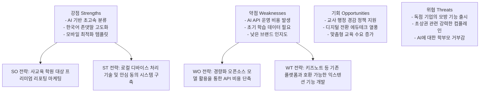

# AI 기반 영유아 및 교육 기관 활동 리포팅 솔루션 시장 조사 및 분석 보고서
**서비스명(안): 뜻밖의 리포트 AI (ClassSnap AI)**

본 보고서는 교사가 작성한 비정형 수업 기록과 촬영된 다량의 사진을 AI 기술(인물 식별 및 LLM 텍스트 구조화)을 통해 학생별 맞춤형 모바일 리포트로 자동 생성하는 솔루션의 글로벌 및 국내 시장 분석 보고서입니다. 본 문서는 AI 교육 보조 도구 분야의 사업 전략 수립 및 Gem 지식(Knowledge) 베이스 구축을 위해 작성되었습니다.

---

## 1. 글로벌 유사 시장 및 경쟁사 분석

글로벌 에듀테크 및 가정-학교 커뮤니케이션(Home-School Communication) 시장은 코로나19 이후 디지털화가 급격히 진행되었으며, 단순 공지 전달 수준을 넘어 학생 포트폴리오 관리 및 데이터 기반 피드백 솔루션으로 진화하고 있습니다.

### 대표적인 글로벌 서비스 (Top 3)

#### (1) Seesaw (북미)
*   **개요**: 학생 중심의 디지털 포트폴리오 및 학습 관리 플랫폼입니다.
*   **IPO 구조**:
    *   **Input**: 학생이 직접 촬영한 사진/동영상/음성 녹음 및 교사의 활동 템플릿.
    *   **Process**: 학년별/과목별 태깅 시스템, AI 기반 활동 추천 및 학습 보조 기능.
    *   **Output**: 부모에게 실시간 공유되는 학생 포트폴리오, 교사용 루브릭 채점 보고서.
*   **비즈니스 모델**: 프리미엄(Freemium) 모델. 개인 교사는 기본 기능을 무료로 사용할 수 있으며, 학교/교육청 단위 도입 시 유료 라이선스(구독형) 판매.
*   **주요 트렌드**: AI 어시스턴트를 도입하여 교사의 피드백 초안 작성을 보조하고, 특수 교육 대상 학생을 위한 접근성 편의 기능을 대폭 확대하고 있습니다.

#### (2) ClassDojo (글로벌)
*   **개요**: 전 세계 180개국 이상에서 사용되는 학급 운영 및 행동 발달 관리 플랫폼입니다.
*   **IPO 구조**:
    *   **Input**: 실시간 행동 점수(피드백 포인트), 학급 피드 사진/동영상.
    *   **Process**: 행동 분석 데이터 시각화 및 자동 메시지 번역.
    *   **Output**: 실시간 학부모 피드 및 행동 분석 리포트.
*   **비즈니스 모델**: B2B(학교 대상)는 무료로 제공하되, 학부모 대상의 B2C 유료 구독 서비스('ClassDojo Plus')를 통해 자녀의 상세 활동 데이터 및 가정 내 행동 강화 기능을 제공하여 수익을 극대화합니다.
*   **주요 트렌드**: 가상 교실 환경 구축 및 아바타 커스터마이징 등 메타버스 요소를 결합하고 있습니다.

#### (3) Brightwheel (북미)
*   **개요**: 영유아 보육 및 교육 기관(Daycare, Preschool) 전용 올인원 운영 관리 솔루션입니다.
*   **IPO 구조**:
    *   **Input**: 아이의 등하원 시간, 식사/수면/배변 기록, 활동 사진.
    *   **Process**: 실시간 타임라인 자동 매핑 및 원비 수납 자동화.
    *   **Output**: 실시간 알림장 보고서, 매월 보육료 정산 리포트.
*   **비즈니스 모델**: 기관 규모(원아 수)에 따른 월간/연간 SaaS 구독 모델.
*   **주요 트렌드**: 기관 경영 효율성(Fintech 결합)과 정부 규제 준수를 위한 자동 행정 문서 생성 기능 강화.

---

## 2. 국내 시장 현황 및 갭 분석 (Gap Analysis)

### 국내 동종 업계 경쟁사 현황

#### (1) 키즈노트 (KidsNote)
*   **현황**: 카카오 계열사로, 대한민국 영유아 교육 기관 알림장 시장 점유율 80% 이상을 차지하는 독점적 플랫폼입니다.
*   **특수성**: 알림장, 공지사항, 투약 의뢰서 등 기관 행정의 표준으로 자리 잡았으나, 교사가 수동으로 사진을 분류하고 개개인 알림장을 작성해야 하는 **극심한 노동 집약적 구조**를 유지하고 있습니다.

#### (2) 클래스팅 (Classting)
*   **현황**: 초중고교 중심의 SNS형 커뮤니케이션 플랫폼에서 최근 AI 디지털 교과서 및 개별 맞춤형 학습 분석 솔루션으로 진화하고 있습니다.
*   **특수성**: 공교육 시장 중심이며, 학급 활동 아카이빙보다는 교과 성취도 평가 및 학업 데이터 분석에 집중하고 있습니다.

### 한국 시장만의 특수성 및 진입 장벽

1.  **교사의 행정 부담과 알림장 스트레스**: 
    한국 학부모의 교육 참여도와 관심도는 세계 최고 수준입니다. 이에 따라 교사는 매일 퇴근 후 1~2시간씩 원아 개별 알림장을 정성껏 작성해야 하는 감정적·시간적 노동에 시달리고 있습니다.
2.  **엄격한 개인정보보호법 및 초상권 이슈**:
    가장 큰 민감 요소는 '초상권'입니다. 다른 아이의 얼굴이 섞인 사진이 필터링 없이 공유되는 것에 대해 컴플레인이 잦습니다. 국내 시장 진입 시 **개인정보 유출 우려가 없는 로컬/온디바이스 AI 식별 기술** 또는 **철저한 동의 기반의 마스킹(블러) 처리**가 필수적입니다.
3.  **정서적 교감의 요구**:
    학부모들은 AI가 쓴 듯한 기계적이고 딱딱한 문체를 선호하지 않습니다. 정중하고 따뜻한 격려식 문체(경어체)를 일관되게 제공하는 국어 LLM 튜닝이 핵심 경쟁력입니다.

---

## 3. 글로벌 vs 국내 서비스 비교 분석 (Cross-Market Gap)

| 비교 항목 | 글로벌 서비스 (Seesaw, ClassDojo) | 국내 지배 서비스 (키즈노트) | **뜻밖의 리포트 AI (ClassSnap AI)** |
| :--- | :--- | :--- | :--- |
| **주요 타겟** | 초중등(K-12) 및 유아 교육 기관 | 영유아 보육 기관 및 유치원 | 예체능 학원, 대안 학교, 영유아 특수 교육 |
| **핵심 가치** | 학생 주도 포트폴리오 & 행동 관리 | 알림장 전달 및 원 관리 행정 | **교사 업무 혁신 (사진 자동 분류 + AI 피드백)** |
| **사진 분류 방식** | 수동 업로드 또는 학생 직접 태깅 | 교사가 수동으로 선별 및 분류 | **얼굴 인식 AI를 통한 원클릭 인물 매칭** |
| **텍스트 피드백** | 교사가 직접 타이핑 (AI는 초안 보조) | 교사가 개별 타이핑 (복사/붙여넣기 잦음) | **비정형 메모 입력 시 학생별 맞춤 다듬기** |
| **수익 모델** | 학부모 추가 옵션 구독 / 학교 구독 | 광고 및 커머스 (알림장은 교사 무료) | **기관 맞춤형 SaaS (건당 또는 월간 구독)** |

### 국내 시장 공략을 위한 니치(Niche) 전략
*   **키즈노트의 틈새 공략**: 키즈노트는 플랫폼 독점력이 강하지만, 기능 개선 속도가 느리고 사진 자동 분류 및 AI 피드백 생성 기능이 없습니다. 우리 서비스는 키즈노트의 대체재가 아닌, **교사의 작업 시간을 단축시켜 주는 '스마트 라이터 & 사진 정리기' 형태의 툴킷(SaaS)**으로 우선 접근하여 키즈노트에 업로드할 결과물을 신속하게 뽑아주는 유틸리티로 시장을 선점할 수 있습니다.
*   **예체능 및 학원 시장 타겟**: 규제가 강하고 보수적인 공교육/공립어린이집보다 피드백 퀄리티가 원생 유지율(Retention)에 직결되는 미술, 체육, 음악 학원 등 **사교육 및 체험형 교육 시장**에 먼저 적용하여 서비스의 가치를 입증합니다.

---

## 4. SWOT 및 차별화 전략

### 차별화 전략 (Differentiation Strategy)

1.  **Zero-Touch AI 파이프라인 (초대형 강점)**:
    교사는 수업이 끝나고 카메라 메모리카드 혹은 폰 사진 전체를 드래그 앤 드롭하고, 연습장에 적은 대충의 수업 일지를 사진 찍어 업로드(OCR)하거나 음성 메모를 텍스트로 전환하여 던져주기만 하면 됩니다. 분류부터 텍스트 생성까지 단 1분 만에 끝내는 압도적 편의성을 제공합니다.
2.  **자동 결석 보정 및 따뜻한 맞춤형 격려 피드백**:
    단순 텍스트 매칭 오류나 누락 데이터(결석 또는 미작성 원아)에 대해 무미건조한 빈칸 대신, "오늘 OO이가 아쉽게 참여하지 못했으나, 진행된 신체 놀이의 긍정적 효과를 바탕으로 다음 시간에 더욱 유익한 피드백을 전달하겠다"는 식의 친근하고 정교한 맞춤 문장을 자동 생성합니다.
3.  **로컬 보안 우선 구조**:
    아동 사진 유출 민감성을 해결하기 위해, 얼굴 인식 프로세스를 웹 브라우저 내(WebAssembly 기반 클라이언트 사이드 태깅) 또는 서버 저장 즉시 파기 방식으로 구상하여 학부모와 기관의 심리적 저항선을 최소화합니다.
